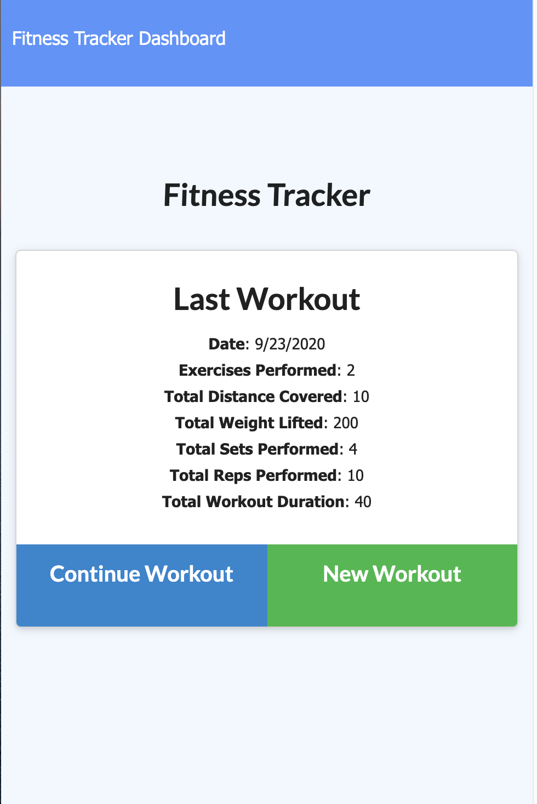
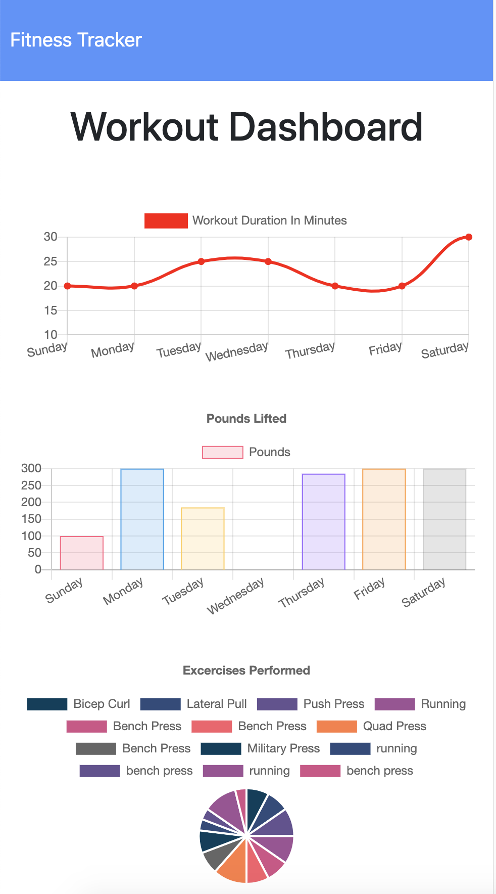

# Workout-Tracker

## Description
The Fitness Tracker is an application that allows users to view, create and track daily workouts. Users can choose to create a new workout or add exercises to an exisiting workout. The application also develops a dashboard using a week of data, so that users can see their progress more systematically. 

  

 

## Usage
The app is deployed on heroku:
  
## Development
In this application I was able to take already developed frontend code (located in the 'public' directory) and create the backend code to ensure the functionality of the application. As a developer, it is very important to be flexible and develope new code on top of an existing codebase. My roles in this application includes:

- Assessing given frontend code and develope backend code based on what is given
- Establishiing the server and html, api routes
- Using the Model–View–Controller to ensure organization of code as well as seperation of tasks
- Writing mongoose schemas and CRUD operations for a deployed MongoDB database, and making those operations available on the client side
